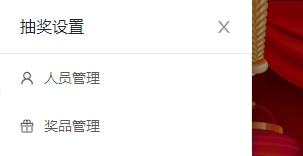
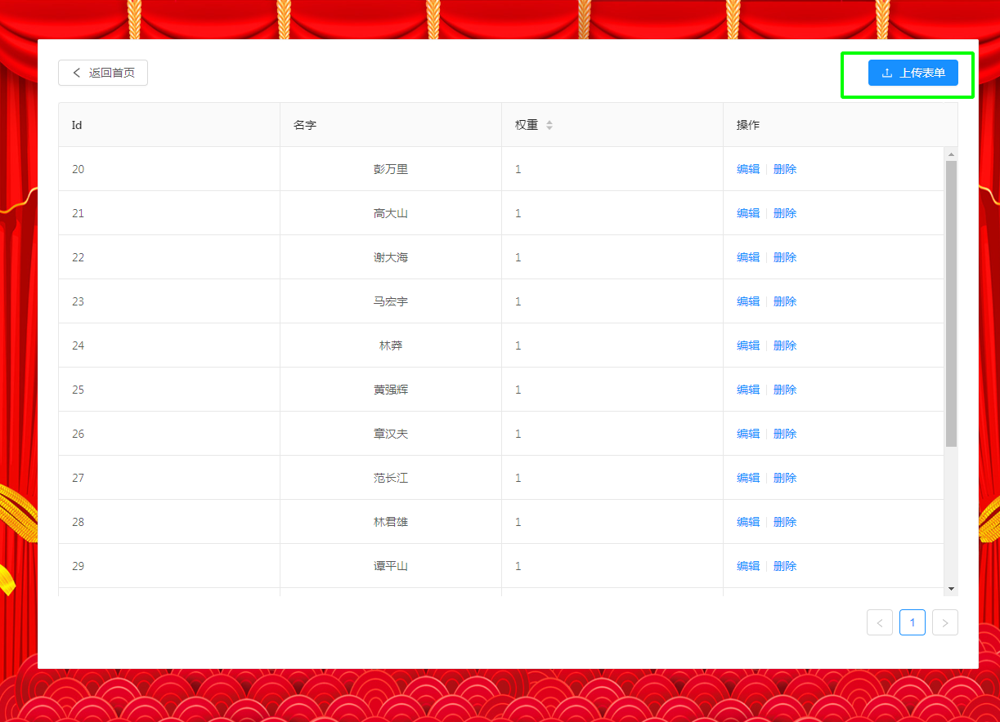
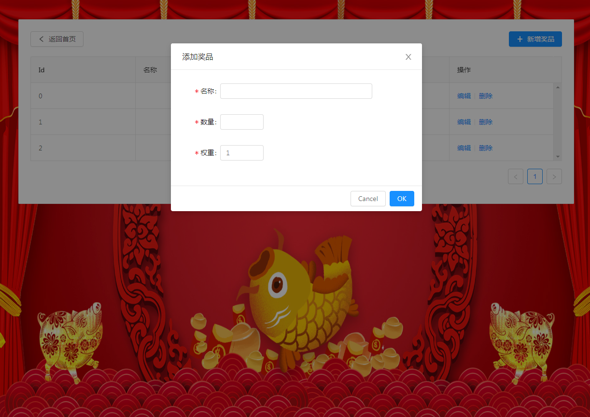

</img>

NewYearLottery 是一个基于react + dva + antd + python + wxpy 开发的，集成了微信群消息同步的WEB版抽奖系统。

# 前端安装
```bash
$ git clone https://github.com/t880216t/NewYearLottery.git
$ cd NewYearLottery
$ cnpm install
```

# 服务端安装
```bash
$ cd NewYearLottery/server
$ python -m venv venv
$ pip install -r requirements.txt
```

# 启动服务端开发服务器
服务端 server/app/__init__.py 有个微信群配置```app.config['WX_GROUP'] = '666'```需要根据自己实际的情况改成对应要监控的群。扫码如果登录不了，具体报错参见[wxpy](https://wxpy.readthedocs.io/)。
```bash
$ python run.py
```
服务端默认是```5000```端口，请确保没有被占用。

# 启动前端开发服务器
```bash
$ npm start
```

打开网址：http://localhost:8000

# 使用步骤
主页左下角有个隐藏的设置按钮

</img>
</img>

## 1.导入抽奖用户
用户名单的模板在项目文件中“NewYearLottery/resource/员工名单.xlsx”，根据自己的实际情况后修改后，进入用户管理页面“上传表单”

</img>

上传后可以自行编辑用户表单。


## 2.添加奖品设置
点击“奖品设置”设置奖品信息，这里的会根据权重来安排抽奖顺序（**<big>按数字从小到大</big>**），会根据数量设置来安排每次的抽奖人数（请保证最终获奖的人数小于等于总抽奖人数）。

</img>

## 3.开始抽奖

回到首页，确认有奖品及用户数据后即可开始抽奖。

> 注意：开始抽奖后请勿刷新页面，否则将<font color=red>重头开始抽奖活动</font>


# 设计思想

本应用是完全独立的前端应用，不涉及后端交互。所以部署后，每个人看到界面的虽是一样，但每个人的数据是不同的，奖品及人员信息都在管理的session storage中，这样也避免了接口安全问题。
借助微信群消息监控，实时进行转发，并在抽奖系统中实时展示，以增加参与者的互动乐趣。

# 核心代码
应用使用dva管理数据流，核心的数据方法都在“NewYearLottery/src/models/lottery.js”中。
服务端消息转发部分在"server/app/core/wxChat.py"中。

每轮滚动的人员列表都会随机洗牌，滚动数据每50ms刷新一次。
```javascript

/**
 * 随机洗牌
 *
 */
export function shuffle(arr) {
  let randomIndex = 0;
  for (var i = 0; i < arr.length; i++) {
    randomIndex = Math.floor(Math.random() * (arr.length - i));
    let temp = arr[i];
    arr[i] = arr[randomIndex];
    arr[randomIndex] = temp;
  }
  return arr
}

```

# 开源地址

https://github.com/t880216t/NewYearLottery

# 参考资料

* DvaJS https://dvajs.com/
* 抽奖程序（React）https://blog.csdn.net/Jason847/article/details/86560894
* Ant Design https://ant.design/index-cn
